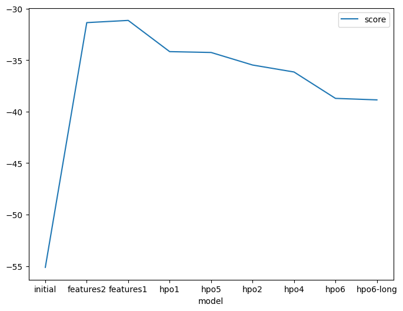
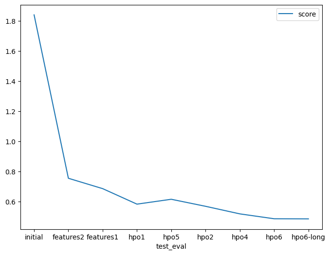

# Report: Predict Bike Sharing Demand with AutoGluon Solution
#### Svetlana Bogdanova

## Initial Training
### What did you realize when you tried to submit your predictions? What changes were needed to the output of the predictor to submit your results?
I had to  drop columns=['casual', 'registered'] from the input set as they were not present in test set
Predictions shoulld not  have values  <0 , so I set all negative values  to 0. There were 2 at that time

### What was the top ranked model that performed?
WeightedEnsemble_L3  -55.123669

## Exploratory data analysis and feature creation
### What did the exploratory analysis find and how did you add additional features?
There was a correlation between bike counts and weather parameters, day of the week, holiday / workday. Being a competitive bike rider, I felt that the most correlations I need to consider were 1. hour of the day. 2. day of the week 3. weather - correlates with atemp (feels like) that I used to create new features. Adding overriding weather can simplify the model , so I tested performance before using the new engineered weather featuren and it  was indeed better with the new weather feauture (included in reports)

### How much better did your model preform after adding additional features and why do you think that is?
That improved the model significantly (see table)

## Hyper parameter tuning
### How much better did your model preform after trying different hyper parameters?
Tuning hyperparameted improved the model, however the effect was not as pronounced, AutoGluon already optimized the models by default. The most obvious improvements were to remove low performing models from optimization set, adding more time to train and experiment with individual model's parameters. However the later would require some computational time that I did not have.

### If you were given more time with this dataset, where do you think you would spend more time?
1. I will work on the new features that inlude logging historic data into the model and taking into account other data
2. Look into heatmaps to see what features are the most important 
3. I think I do not have enough knowledge to decide how to tune individual models yet. I will explore individual models and try to tune them and use later top 3 performers as ensamble model
4. I will extend training times 

### Create a table with the models you ran, the hyperparameters modified, and the kaggle score.

                models used in AutoGluon	features	                                            hyperparameter_tune_kwargs	score 
________________________________________________________________________________________________________________				
original	    AutoGluon standard	        no new features		
new_feature2	AutoGluon standard	        season, hour of the day, day of the week		                                    0.75401
new_feature1	AutoGluon standard	        weather, season, hour of the day, day of the week		                            0.68507
hpo1	        exclude KNN from standard	weather, season, hour of the day, day of the week		                            0.582
hpo5	        GBM,CAT,XGB,NN_TORCH	    weather, season, hour of the day, day of the week		                            0.6144
hpo2	        GBM, RF, CAT	            weather, season, hour of the day, day of the week		                            0.56763
hpo4	        GBM, CAT	                weather, season, hour of the day, day of the week	                            yes	0.51728
hpo6	        GBM, RF, CAT	            weather, season, hour of the day, day of the week	                            yes	0.4848
hpo6-log        GBM, RF, CAT	            weather, season, hour of the day, day of the week	                            yes	0.48414

	hyperparameter_tune_kwargs = {	
	'num_trials': 20, # Try 20 different configurations	
	'scheduler': 'local', # Run on local machine	
	'searcher': 'random', # Random search for hyperparameters	
	'max_t': 600 # Max time for each trial is 600 seconds	
	}	
    
    There were slight variations in hyperparameters per model (values used are seen in the source code), no dramatic change
    all experiments  ran 600 seconds,  hpo6-long ran 2100 seconds

### Create a line plot showing the top model score for the three (or more) training runs during the project.

### Create a line plot showing the top kaggle score for the three (or more) prediction submissions during the project.

TODO: Replace the image below with your own.

## Summary
I was able to learn a lot after this project

